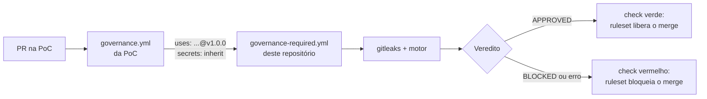

# Plataforma de Governança e SecLLMOps

Políticas-como-código avaliadas em todo Pull Request da organização, com regras
determinísticas como base, revisão semântica por LLM apenas como camada aditiva, e
evidência atestada por commit.

**Guia completo** (regras, funcionamento, como usar, como aplicar, boas práticas e
problemas comuns): [docs/guia.md](docs/guia.md).

Decisão de arquitetura: [ADR-GOV-000](adrs/ADR-GOV-000-modelo-de-governanca.md).
Origem: a PoC `virtualthreads` (pipeline Gemini no PR) e o roteiro em
`docs/Governança SecLLMOps Enterprise.docx`.

## Como funciona

1. O ruleset da organização exige o workflow
   [governance-required.yml](.github/workflows/governance-required.yml) em todo PR, numa
   ref fixada deste repositório. O repo-alvo não consegue alterá-lo.
2. O workflow faz checkout do PR (como dado) e do motor (desta revisão), roda o gitleaks
   nos commits do PR e o motor sobre o diff.
3. O motor escolhe as políticas cujo `scope` casa com os arquivos alterados e aplica:
   - **T0 determinístico** (regex, path): bloqueia em `enforce` + `CRITICAL`;
   - **T1 LLM** (só políticas com `enforcement.llm`): recebe o conteúdo sem segredos,
     delimitado por uma tag com nonce; só acrescenta achados; só bloqueia com
     `llm.blocking: true`, que exige evidência de eval.
4. Waivers válidos (aprovador ≠ solicitante, até 90 dias) são descontados.
5. Saídas: comentário no PR, SARIF no Code Scanning, `result.json` atestado (Sigstore) e
   guardado como artefato. Qualquer erro bloqueia.

## Políticas

| Id | Modo | Camadas |
|---|---|---|
| ARCH-HEX-001 domínio sem Spring/JPA | enforce | regex + ArchUnit no build |
| ARCH-HEX-002 camadas internas sem infrastructure | enforce | regex + ArchUnit no build |
| LGPD-LOG-001 dado pessoal em log/trace/métrica | enforce | regex (bloqueia) + LLM (consultivo) |
| SEC-SECRET-001 credencial versionada | enforce | regex + gitleaks |
| SEC-UNICODE-001 caracteres invisíveis/bidi | enforce | regex |
| SEC-OBFUSC-001 escape Unicode fora de literal (Java) | enforce | regex |
| LLM-INJ-001 texto dirigido a IA | warn | regex + LLM (sinal) |
| GOV-SELF-001 mudança em CI/instruções de IA | warn | path |
| QUAL-CODE-001 regras objetivas de qualidade | warn | LLM |
| OWASP-A01/A02/A03/A04/A10 | audit | só exportadas para o AWS Security Agent |

## Adoção em um repositório-alvo

1. Copie [templates/target-repo/CODEOWNERS](templates/target-repo/CODEOWNERS) para
   `.github/CODEOWNERS` do repo-alvo.
2. Remova o workflow de IA local (na PoC: `.github/workflows/ai-governance.yml` e
   `.github/scripts/orchestrator.py`), que lia prompts do próprio PR.
3. Mantenha o ArchUnit no build: é a verificação de arquitetura sobre o bytecode.

## Configuração da organização (uma vez)

1. Publique uma tag deste repositório (ex.: `v1.0.0`) e aplique
   [templates/org-ruleset.json](templates/org-ruleset.json) com o `repository_id` dele.
2. Secrets da organização: `GEMINI_API_KEY` e, se este repositório for privado,
   `GOVERNANCE_READ_TOKEN` (somente leitura neste repositório).
3. Ajuste `GOVERNANCE_REPOSITORY` no workflow se o nome do repositório mudar.
4. Confirme no primeiro PR que `github.workflow_sha` aponta para a revisão deste
   repositório: se não apontar, o checkout do motor falha e o PR é bloqueado
   (fail-closed), sem aprovar nada indevidamente.

## Modo conta pessoal (sem organização, provisório)

Sem organização não há required workflow. O repo-alvo chama o workflow central:

1. Copie [templates/target-repo/governance.yml](templates/target-repo/governance.yml) para
   `.github/workflows/governance.yml` do repo-alvo, com a mesma tag no `uses:` e em
   `governance_ref`.
2. Secret `GEMINI_API_KEY` no repo-alvo. Se este repositório for privado, libere-o em
   *Settings → Actions → General → Access* para os repositórios da sua conta.
3. Ruleset do repo-alvo no branch principal: exigir PR e o status check
   `governance / governance`. Rulesets em repositório privado exigem plano Pro.

Limite conhecido: o PR pode editar ou remover a chamada (ADR-GOV-000, alternativas
rejeitadas). O CODEOWNERS e o check obrigatório só reduzem esse risco. Migre para o
ruleset da organização antes de tratar o resultado como controle.

### O que acontece em um PR, passo a passo

Exemplo com a PoC `robertosrjr/virtualthreads`, que chama este repositório na tag `v1.0.0`.



**1. Alguém abre um PR na PoC** (ou faz push no branch dele, ou reabre o PR).

**2. O workflow da PoC dispara.** O arquivo `.github/workflows/governance.yml` da PoC diz
só *quando* rodar e *qual versão* usar:

```yaml
on:
  pull_request:
    types: [opened, synchronize, reopened]   # abrir, novo push, reabrir
jobs:
  governance:
    uses: robertosrjr/governance-policies/.github/workflows/governance-required.yml@v1.0.0
    with:
      governance_ref: v1.0.0                  # a mesma tag do 'uses:'
    secrets: inherit                          # repassa o GEMINI_API_KEY da PoC
```

**3. O workflow central roda** ([governance-required.yml](.github/workflows/governance-required.yml)),
em um runner do GitHub:

| Passo do workflow | O que faz |
|---|---|
| Checkout do repositório-alvo | Baixa o código do PR em `target/`. É tratado como **dado**, nunca como instrução. |
| Checkout do motor | Baixa **este** repositório na tag `v1.0.0` em `governance/`: motor, políticas, prompts e modelo. |
| Instalar dependências | `pip install --require-hashes`: só instala pacotes com hash conferido. |
| gitleaks | Procura segredos em **cada commit** do PR, inclusive nos já apagados. |
| Avaliar políticas | `python -m governance review`: aplica as regras determinísticas (T0) e o LLM (T1) no diff e comenta o relatório no PR. |
| Publicar SARIF | Envia os achados para o Code Scanning. Aparecem como os checks `enterprise-governance` e `gitleaks`. |
| Atestar o resultado | Assina o `result.json` (Sigstore). É a evidência do gate de deploy. |
| Guardar evidência | Salva `out/` como artefato `governance-<sha>` por 90 dias. |
| Veredito | Só passa se o motor **e** o gitleaks terminarem com 0. Qualquer erro reprova (fail-closed). |

**4. O resultado vira o check `governance / governance`** (job da PoC / job central). O
ruleset `protecao-main` da PoC exige esse check e um PR para a `main`:

- ✅ verde: o botão de merge é liberado;
- ❌ vermelho: o merge fica bloqueado, e o comentário do motor no PR diz a política, o
  arquivo e a linha.

### O que saiu da PoC e para onde foi

Antes, a PoC tinha o próprio pipeline de IA (`ai-governance.yml` + `.github/scripts/orchestrator.py`).
O passo que chamava o Gemini veio para o workflow central:

| Antes, na PoC | Agora |
|---|---|
| `run: python .github/scripts/orchestrator.py` | `python -m governance review`, com o motor **deste** repositório. O script antigo vinha do próprio PR, então o PR podia alterar o revisor. |
| `GEMINI_API_KEY`, `GITHUB_TOKEN`, `PR_NUMBER`, `BASE_REF` | As mesmas variáveis, no passo "Avaliar políticas" do workflow central. |
| `GEMINI_MODEL: ${{ vars.GEMINI_MODEL }}` | Removido de propósito. O modelo fica em [engine/bundle.yaml](engine/bundle.yaml), para o repositório revisado não poder escolher um modelo mais fraco. |

Na PoC ficam só o **segredo** `GEMINI_API_KEY` (em *Settings → Secrets and variables →
Actions*) e o `governance.yml`. A variável `GEMINI_MODEL` pode ser apagada.

### Testar o bloqueio

Em um branch novo da PoC, coloque uma dependência de framework no domínio, por exemplo
`import org.springframework.stereotype.Component;` em uma classe de
`application/pedidos/src/main/java/.../domain/`, e abra um PR. O esperado é
`ARCH-HEX-001` (CRITICAL), o check `governance / governance` vermelho e o merge bloqueado.
Feche o PR sem merge. Para ver o mesmo resultado antes do push:

```bash
PYTHONPATH=engine python -m governance review --repo ../../java/virtualthreads --base origin/main --no-llm
```

### Publicar uma nova versão das políticas

1. Commit e push na `main` deste repositório.
2. Nova tag, sem mover as antigas: `git tag -a v1.1.0 -m "..."` e `git push origin v1.1.0`.
3. Na PoC, troque a tag nos **dois** lugares do `governance.yml` (`@v1.1.0` no `uses:` e
   `governance_ref: v1.1.0`) e faça isso por PR: o próprio PR já roda na versão nova.

## Gate de deploy

O deploy de um commit só prossegue com um `result.json` atestado e aprovado para ele:

```bash
gh run download <run-id> -R org/app -n "governance-${SHA}" -D evidence
gh attestation verify evidence/result.json -R org/app \
  --predicate-type https://github.com/robertosrjr/governance-policies/governance-result/v1 \
  --signer-workflow robertosrjr/governance-policies/.github/workflows/governance-required.yml
jq -e --arg sha "$SHA" '.status == "APPROVED" and .subject.commit == $sha' evidence/result.json
```

O `--signer-workflow` é essencial: sem ele, um workflow qualquer do repo-alvo poderia
atestar um `result.json` forjado.

Isso fecha o caso do merge feito por cima do check: sem evidência, não há deploy.

## Desenvolvimento

```bash
pip install --no-deps --require-hashes -r engine/requirements-dev.lock
python -m pytest
PYTHONPATH=engine python -m governance validate
PYTHONPATH=engine python -m governance export --check
PYTHONPATH=engine python -m governance eval
```

Regras para editar este repositório: [CLAUDE.md](CLAUDE.md).
