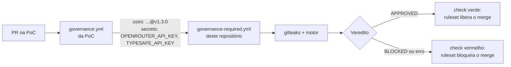

# Plataforma de Governança e SecLLMOps

Políticas-como-código avaliadas em todo Pull Request da organização, com regras
determinísticas como base, revisão semântica por LLM apenas como camada aditiva, e
evidência atestada por commit.

**Guia completo** (regras, funcionamento, como usar, como aplicar, boas práticas e
problemas comuns): [docs/guia.md](docs/guia.md).

**Manual de configuração** (passo a passo para ligar a governança em um repositório, do
zero ao primeiro PR bloqueado): [docs/manual-configuracao.md](docs/manual-configuracao.md).

**Fluxo da esteira** (diagramas de sequência: ciclo de vida de uma regra, avaliação do
PR, deploy e auditoria, e cada arquivo lido ou gerado): [docs/fluxo-da-esteira.md](docs/fluxo-da-esteira.md).

Decisão de arquitetura: [ADR-GOV-000](adrs/ADR-GOV-000-modelo-de-governanca.md). Todas as
decisões estão em [Decisões de arquitetura (ADRs)](#decisões-de-arquitetura-adrs).
Origem: a PoC `virtualthreads` (pipeline Gemini no PR) e o roteiro em
`docs/Governança SecLLMOps Enterprise.docx`.

## Decisões de arquitetura (ADRs)

O ADR explica o porquê; a regra verificável fica em `policies/*.yaml`, que aponta o seu
ADR. *Proposto* = depende de decisão fora do time de plataforma (jurídico, segurança da
informação, plataforma corporativa).

**A plataforma**

| ADR | Decisão | Status |
|---|---|---|
| [ADR-GOV-000](adrs/ADR-GOV-000-modelo-de-governanca.md) | Modelo: quem governa fica separado de quem é governado; determinístico primeiro, LLM só aditivo; uma regra, uma fonte; fail-closed | Aceito |
| [ADR-GOV-001](adrs/ADR-GOV-001-provedor-llm-openrouter.md) | Provedor de LLM via OpenRouter, com modelo fixo e chave por projeto | Aceito |
| [ADR-GOV-002](adrs/ADR-GOV-002-julgamento-tipado-jev.md) | Julgamento tipado (Jev): a regex localiza, o modelo só devolve probabilidade | Aceito |
| [ADR-GOV-003](adrs/ADR-GOV-003-operacao-em-instituicao-financeira.md) | Operação em instituição financeira: dado pessoal fora do LLM, provedor de IA (CMN 4.893, LGPD Art. 33), rollout `warn` → `enforce`, segregação de funções | Proposto |
| [ADR-GOV-004](adrs/ADR-GOV-004-decisao-estrutural-exige-adr.md) | Decisão estrutural (dependência, módulo, datastore novo) chega com o seu ADR | Aceito |
| [ADR-GOV-005](adrs/ADR-GOV-005-gate-de-deploy-e-retencao-de-evidencia.md) | Gate de deploy verifica a atestação; evidência em armazenamento imutável | Aceito |
| [ADR-GOV-006](adrs/ADR-GOV-006-painel-de-conformidade.md) | Painel de conformidade; falso positivo medido pelo Code Scanning | Aceito |
| [ADR-GOV-007](adrs/ADR-GOV-007-release-e-versionamento.md) | Release e versionamento: tag não se move, smoke test no destino, sem submódulo | Aceito |
| [ADR-GOV-008](adrs/ADR-GOV-008-skills-como-orientacao.md) | Skills orientam, políticas decidem; triagem das skills; políticas como fitness functions | Aceito |
| [ADR-GOV-009](adrs/ADR-GOV-009-classificacao-de-repositorios.md) | Classificação de repositórios: a classe decide se o código vai para a IA e quais regras endurecem | Aceito |

**Regras para o código dos repositórios-alvo**

| ADR | Decisão | Políticas | Status |
|---|---|---|---|
| [ADR-ARCH-001](adrs/ADR-ARCH-001-arquitetura-hexagonal.md) | Domínio isolado na arquitetura hexagonal | ARCH-HEX-001/002 | Aceito |
| [ADR-ARCH-002](adrs/ADR-ARCH-002-relogio-e-fuso-explicitos.md) | Relógio injetável e fuso explícito na regra de negócio | ARCH-TIME-001 | Aceito |
| [ADR-FIN-001](adrs/ADR-FIN-001-aritmetica-monetaria.md) | Aritmética monetária exata e arredondamento explícito | FIN-MONEY-001 | Aceito |
| [ADR-FIN-002](adrs/ADR-FIN-002-idempotencia-em-escrita-financeira.md) | Escrita financeira idempotente; nada de retry cego | RES-IDEMP-001 | Aceito |
| [ADR-LGPD-001](adrs/ADR-LGPD-001-dado-pessoal-em-observabilidade.md) | Dado pessoal fora de logs, traces, métricas e exceções | LGPD-LOG-001 | Aceito |
| [ADR-LGPD-002](adrs/ADR-LGPD-002-dado-pessoal-real-no-repositorio.md) | Repositório não é ambiente para dado pessoal real | LGPD-DATA-001 | Aceito |
| [ADR-SEC-001](adrs/ADR-SEC-001-segredos-e-manipulacao-de-revisores.md) | Segredos, ofuscação e manipulação de revisores | SEC-SECRET/UNICODE/OBFUSC-001, LLM-INJ-001 | Aceito |
| [ADR-SEC-002](adrs/ADR-SEC-002-requisitos-owasp-2025.md) | Requisitos OWASP Top 10:2025; configuração Spring segura | OWASP-A01..A10, SEC-CONFIG-001 | Aceito |
| [ADR-SEC-003](adrs/ADR-SEC-003-criptografia-e-dados-de-cartao.md) | Criptografia verificável e nenhum dado de cartão no repositório | SEC-CRYPTO-001, SEC-PAN-001 | Aceito |
| [ADR-DATA-001](adrs/ADR-DATA-001-evolucao-de-schema.md) | Migrações imutáveis e expand/contract | DATA-MIG-001/002 | Aceito |
| [ADR-DATA-002](adrs/ADR-DATA-002-residencia-de-dados.md) | Residência de dados em região aprovada | DATA-RES-001 | Proposto |
| [ADR-API-001](adrs/ADR-API-001-contratos-compativeis.md) | Contratos de API e de eventos evoluem sem quebrar consumidores | API-CONTRACT-001, EVT-SCHEMA-001 | Aceito |
| [ADR-SUP-001](adrs/ADR-SUP-001-cadeia-de-suprimentos-reproduzivel.md) | Build e imagem reproduzíveis | SUP-DEP-001, SUP-IMG-001 | Aceito |
| [ADR-AI-001](adrs/ADR-AI-001-ia-nas-aplicacoes.md) | IA pelo gateway corporativo e com modelo fixado | AI-GW-001, AI-MODEL-001, GOV-SELF-001 | Proposto |
| [ADR-AI-002](adrs/ADR-AI-002-principios-eticos-como-guardrails.md) | Princípios éticos de IA como guardrails | AI-HUMAN-001, AI-FAIR-001, AI-INV-001 | Aceito |
| [ADR-QUAL-001](adrs/ADR-QUAL-001-regras-de-qualidade.md) | Regras objetivas de qualidade de código | QUAL-CODE-001 | Aceito |

Novo ADR: [templates/adr-template.md](templates/adr-template.md).

## Como funciona

1. O ruleset da organização exige o workflow
   [governance-required.yml](.github/workflows/governance-required.yml) em todo PR, numa
   ref fixada deste repositório. O repo-alvo não consegue alterá-lo.
2. O workflow faz checkout do PR (como dado) e do motor (desta revisão), roda o gitleaks
   nos commits do PR e o motor sobre o diff.
3. O motor lê a **classe do repositório** em `classification/repositories.yaml`
   ([ADR-GOV-009](adrs/ADR-GOV-009-classificacao-de-repositorios.md)): `interno` usa IA;
   `confidencial`, `restrito` e `nao-classificado` rodam sem IA (registrado, sem
   bloquear por isso); `restrito` sobe SEC-PAN-001, LGPD-DATA-001 e SEC-CRYPTO-001 para
   `enforce`. Depois escolhe as políticas cujo `scope` casa com os arquivos alterados e aplica:
   - **T0 determinístico**: bloqueia em `enforce` + `CRITICAL`. Tipos de regra:
     `regex` nas linhas adicionadas (com `validator` confere dígito verificador de
     CPF/CNPJ e Luhn de cartão); `path_changed` (arquivo adicionado, modificado,
     renomeado ou removido); `requires_companion` (se X muda, Y também precisa mudar, ex.:
     dependência nova exige ADR); `contract` (compara base e PR de um contrato OpenAPI ou
     Avro e aponta cada quebra de compatibilidade);
   - **T1 LLM** (só políticas com `enforcement.llm`): recebe o conteúdo sem segredos e
     sem CPF, CNPJ, cartão e e-mail literais (trocados por um marcador do tipo),
     delimitado por uma tag com nonce; só acrescenta achados; só bloqueia com
     `llm.blocking: true`, que exige evidência de eval.
4. Waivers válidos (aprovador ≠ solicitante, até 90 dias) são descontados.
5. Saídas: comentário no PR, SARIF no Code Scanning, `result.json` atestado (Sigstore),
   guardado como artefato e, com a retenção configurada, gravado num bucket imutável
   (Object Lock). Qualquer erro bloqueia.
6. No deploy, o [gate de deploy](.github/workflows/governance-deploy-gate.yml) acha o PR
   do commit implantado, verifica a atestação (assinada pelo workflow central) e o
   veredito. Sem PR aprovado, não implanta
   ([ADR-GOV-005](adrs/ADR-GOV-005-gate-de-deploy-e-retencao-de-evidencia.md)).

7. Toda segunda-feira, o [painel de conformidade](.github/workflows/compliance-dashboard.yml)
   consolida os vereditos dos repositórios de `dashboard/repos.txt`: achados, bloqueios e
   falso positivo por política (alerta dispensado como "False positive" no Code
   Scanning), prontidão de cada política para `enforce`, bloqueios por erro da esteira e
   waivers vencendo ([ADR-GOV-006](adrs/ADR-GOV-006-painel-de-conformidade.md)).
   Localmente: `python -m governance dashboard --repo owner/repo` (com `GITHUB_TOKEN`).

Fluxo completo, arquivos lidos e gerados em cada etapa:
[docs/fluxo-da-esteira.md](docs/fluxo-da-esteira.md).

## Políticas

| Id | Modo | Camadas |
|---|---|---|
| ARCH-HEX-001 domínio sem Spring/JPA | enforce | regex + ArchUnit no build |
| ARCH-HEX-002 camadas internas sem infrastructure | enforce | regex + ArchUnit no build |
| LGPD-LOG-001 dado pessoal em log/trace/métrica | enforce | regex (bloqueia) + LLM (consultivo) |
| SEC-SECRET-001 credencial versionada | enforce | regex + gitleaks |
| SEC-UNICODE-001 caracteres invisíveis/bidi | enforce | regex |
| SEC-OBFUSC-001 escape Unicode fora de literal (Java) | enforce | regex |
| FIN-MONEY-001 dinheiro em double/float, divide/setScale sem RoundingMode | warn | regex |
| SEC-CRYPTO-001 hash/cifra fraca, TLS antigo, verificação desligada, Random em segredo | warn | regex |
| SEC-PAN-001 número de cartão versionado (PCI DSS) | warn | regex + Luhn |
| LGPD-DATA-001 CPF válido versionado (massa de teste, config, docs) | warn | regex + dígito verificador |
| SEC-CONFIG-001 configuração Spring insegura em produção | warn | regex |
| DATA-MIG-001 migração versionada editada, renomeada ou removida | warn | path (só modificado) |
| DATA-MIG-002 DDL/DML destrutivo sem expand/contract | warn | regex |
| DATA-RES-001 região de nuvem fora da lista aprovada (Terraform) | warn | regex |
| ARCH-TIME-001 relógio/fuso da máquina no domínio | warn | regex |
| API-CONTRACT-001 quebra de contrato OpenAPI | warn | contract (base × PR) |
| EVT-SCHEMA-001 quebra de schema Avro | warn | contract (base × PR) |
| RES-IDEMP-001 retry em escrita financeira sem idempotência | warn | regex de candidatos + Jev |
| SUP-DEP-001 dependência SNAPSHOT ou versão flutuante | warn | regex |
| SUP-IMG-001 imagem sem digest, root, curl \| sh | warn | regex |
| AI-GW-001 SDK ou endpoint de LLM fora do gateway corporativo | warn | regex |
| AI-MODEL-001 modelo de IA não fixado (latest/auto/roteador) | warn | regex |
| AI-HUMAN-001 decisão sobre cliente tomada só pela IA (LGPD Art. 20) | warn | regex de candidatos + Jev |
| AI-FAIR-001 dado pessoal sensível em modelo, score ou regra de decisão | warn | regex de candidatos + Jev |
| AI-INV-001 uso novo de IA sem entrada no inventário de IA | warn | requires_companion |
| GOV-ADR-001 dependência, módulo ou datastore novo sem ADR no PR | warn | requires_companion |
| LLM-INJ-001 texto dirigido a IA | warn | regex + LLM (sinal) |
| GOV-SELF-001 mudança em CI, instruções de IA ou configuração de agentes (MCP) | warn | path |
| QUAL-CODE-001 regras objetivas de qualidade | warn | LLM |
| OWASP-A01/A02/A03/A04/A10 | audit | só exportadas para o AWS Security Agent |

Toda política nova entra em `warn` e sobe para `enforce` pelos critérios do
ADR-GOV-003: casos no eval, duas semanas em `warn` nos repositórios piloto e falso
positivo abaixo de 5%. Cada política aponta o ADR que explica o porquê (`adrs/`).

### Pendências para produção em instituição financeira

- Contratar o provedor de LLM e o Jev como serviço de nuvem avaliado (retenção zero,
  sem treino, região definida, Resolução CMN 4.893 e LGPD Art. 33). Até lá, LLM só em
  repositórios piloto sem dado sensível.
- Classificar cada repositório da organização em `classification/repositories.yaml`
  (fora da lista, o repositório roda sem IA como `nao-classificado`).
- Criar o bucket de evidências ([templates/evidence-store](templates/evidence-store/main.tf))
  com a retenção definida por compliance e preencher `EVIDENCE_BUCKET` e
  `EVIDENCE_ROLE_ARN` no workflow central; ligar o gate de deploy
  ([templates/target-repo/deploy.yml](templates/target-repo/deploy.yml)) nos pipelines.
- Integração com a gestão de mudança (ServiceNow/Jira); criar o segredo `DASHBOARD_TOKEN`
  (leitura de Actions e Code Scanning nos repositórios) para o painel semanal.
- Migrar para organização (required workflow + ruleset com 1 aprovação e CODEOWNERS).
- Gateway corporativo de IA (pré-requisito da AI-GW-001, ADR-AI-001), registry de
  imagens aprovado (ADR-SUP-001) e lista de regiões aprovada (ADR-DATA-002).

## Adoção em um repositório-alvo

1. Copie [templates/target-repo/CODEOWNERS](templates/target-repo/CODEOWNERS) para
   `.github/CODEOWNERS` do repo-alvo.
2. Remova o workflow de IA local (na PoC: `.github/workflows/ai-governance.yml` e
   `.github/scripts/orchestrator.py`), que lia prompts do próprio PR.
3. Mantenha o ArchUnit no build: é a verificação de arquitetura sobre o bytecode.
4. No pipeline de deploy, adicione o job do gate de deploy e faça o deploy depender dele
   ([templates/target-repo/deploy.yml](templates/target-repo/deploy.yml)).

## Configuração da organização (uma vez)

1. Publique uma tag deste repositório (ex.: `v1.0.0`) e aplique
   [templates/org-ruleset.json](templates/org-ruleset.json) com o `repository_id` dele.
2. Secrets da organização: `OPENROUTER_API_KEY` (de preferência restrito aos repositórios
   selecionados) e, se este repositório for privado, `GOVERNANCE_READ_TOKEN` (somente
   leitura neste repositório). Ver [ADR-GOV-001](adrs/ADR-GOV-001-provedor-llm-openrouter.md).
3. Ajuste `GOVERNANCE_REPOSITORY` no workflow se o nome do repositório mudar.
4. Confirme no primeiro PR que `github.workflow_sha` aponta para a revisão deste
   repositório: se não apontar, o checkout do motor falha e o PR é bloqueado
   (fail-closed), sem aprovar nada indevidamente.

## Modo conta pessoal (sem organização, provisório)

Sem organização não há required workflow. O repo-alvo chama o workflow central:

1. Copie [templates/target-repo/governance.yml](templates/target-repo/governance.yml) para
   `.github/workflows/governance.yml` do repo-alvo, com a mesma tag no `uses:` e em
   `governance_ref`.
2. Uma chave da OpenRouter **só deste projeto** (em https://openrouter.ai/keys, com limite
   mensal) como secret do repo-alvo, com o nome que quiser, repassada no `secrets:` do
   `governance.yml` como `OPENROUTER_API_KEY`. Se este repositório for privado, libere-o em
   *Settings → Actions → General → Access* para os repositórios da sua conta.
3. Ruleset do repo-alvo no branch principal: exigir PR e o status check
   `governance / governance`. Rulesets em repositório privado exigem plano Pro.

Limite conhecido: o PR pode editar ou remover a chamada (ADR-GOV-000, alternativas
rejeitadas). O CODEOWNERS e o check obrigatório só reduzem esse risco. Migre para o
ruleset da organização antes de tratar o resultado como controle.

### O que acontece em um PR, passo a passo

Exemplo com a PoC `robertosrjr/virtualthreads`, que chama este repositório na tag `v1.0.0`.



**1. Alguém abre um PR na PoC** (ou faz push no branch dele, ou reabre o PR).

**2. O workflow da PoC dispara.** O arquivo `.github/workflows/governance.yml` da PoC diz
só *quando* rodar e *qual versão* usar:

```yaml
on:
  pull_request:
    types: [opened, synchronize, reopened]   # abrir, novo push, reabrir
jobs:
  governance:
    uses: robertosrjr/governance-policies/.github/workflows/governance-required.yml@v1.3.0
    with:
      governance_ref: v1.3.0                  # a mesma tag do 'uses:'
    secrets:                                  # só a chave do projeto, nunca 'inherit'
      OPENROUTER_API_KEY: ${{ secrets.VIRTUALTHREADS_OR_API_KEY }}
      TYPESAFE_API_KEY: ${{ secrets.VIRTUALTHREADS_JEV_API_KEY }}
```

**3. O workflow central roda** ([governance-required.yml](.github/workflows/governance-required.yml)),
em um runner do GitHub:

| Passo do workflow | O que faz |
|---|---|
| Checkout do repositório-alvo | Baixa o código do PR em `target/`. É tratado como **dado**, nunca como instrução. |
| Checkout do motor | Baixa **este** repositório na tag `v1.3.0` em `governance/`: motor, políticas, prompts e modelo. |
| Instalar dependências | `pip install --require-hashes`: só instala pacotes com hash conferido. |
| gitleaks | Procura segredos em **cada commit** do PR, inclusive nos já apagados. |
| Avaliar políticas | `python -m governance review`: aplica as regras determinísticas (T0) e o LLM (T1) no diff e comenta o relatório no PR. |
| Publicar SARIF | Envia os achados para o Code Scanning. Aparecem como os checks `enterprise-governance` e `gitleaks`. |
| Atestar o resultado | Assina o `result.json` (Sigstore). É a evidência do gate de deploy. |
| Guardar evidência | Salva `out/` como artefato `governance-<sha>` por 90 dias. |
| Veredito | Só passa se o motor **e** o gitleaks terminarem com 0. Qualquer erro reprova (fail-closed). |

**4. O resultado vira o check `governance / governance`** (job da PoC / job central). O
ruleset `protecao-main` da PoC exige esse check e um PR para a `main`:

- ✅ verde: o botão de merge é liberado;
- ❌ vermelho: o merge fica bloqueado, e o comentário do motor no PR diz a política, o
  arquivo e a linha.

### O que saiu da PoC e para onde foi

Antes, a PoC tinha o próprio pipeline de IA (`ai-governance.yml` + `.github/scripts/orchestrator.py`).
O passo que chamava o Gemini veio para o workflow central:

| Antes, na PoC | Agora |
|---|---|
| `run: python .github/scripts/orchestrator.py` | `python -m governance review`, com o motor **deste** repositório. O script antigo vinha do próprio PR, então o PR podia alterar o revisor. |
| `GEMINI_API_KEY`, `GITHUB_TOKEN`, `PR_NUMBER`, `BASE_REF` | As mesmas variáveis, no passo "Avaliar políticas" do workflow central. Desde a v1.2.0 a chave é `OPENROUTER_API_KEY` ([ADR-GOV-001](adrs/ADR-GOV-001-provedor-llm-openrouter.md)). |
| `GEMINI_MODEL: ${{ vars.GEMINI_MODEL }}` | Removido de propósito. O modelo fica em [engine/bundle.yaml](engine/bundle.yaml), para o repositório revisado não poder escolher um modelo mais fraco. |

Na PoC ficam só os **segredos** `VIRTUALTHREADS_OR_API_KEY` e `VIRTUALTHREADS_JEV_API_KEY` (em *Settings → Secrets and
variables → Actions*) e o `governance.yml`. A variável `GEMINI_MODEL` pode ser apagada, e o
`GEMINI_API_KEY` também, depois que a v1.2.1 estiver estável.

### Testar o bloqueio

Em um branch novo da PoC, coloque uma dependência de framework no domínio, por exemplo
`import org.springframework.stereotype.Component;` em uma classe de
`application/pedidos/src/main/java/.../domain/`, e abra um PR. O esperado é
`ARCH-HEX-001` (CRITICAL), o check `governance / governance` vermelho e o merge bloqueado.
Feche o PR sem merge. Para ver o mesmo resultado antes do push:

```bash
PYTHONPATH=engine python -m governance review --repo ../../java/virtualthreads --base origin/main --no-llm
```

### Publicar uma nova versão das políticas

1. Commit e push na `main` deste repositório.
2. Nova tag, sem mover as antigas: `git tag -a v1.1.0 -m "..."` e `git push origin v1.1.0`.
3. Na PoC, troque a tag nos **dois** lugares do `governance.yml` (`@v1.1.0` no `uses:` e
   `governance_ref: v1.1.0`) e faça isso por PR: o próprio PR já roda na versão nova.

## Gate de deploy

O deploy de um commit só prossegue com um `result.json` atestado e aprovado para ele:

```bash
gh run download <run-id> -R org/app -n "governance-${SHA}" -D evidence
gh attestation verify evidence/result.json -R org/app \
  --predicate-type https://github.com/robertosrjr/governance-policies/governance-result/v1 \
  --signer-workflow robertosrjr/governance-policies/.github/workflows/governance-required.yml
jq -e --arg sha "$SHA" '.status == "APPROVED" and .subject.commit == $sha' evidence/result.json
```

O `--signer-workflow` é essencial: sem ele, um workflow qualquer do repo-alvo poderia
atestar um `result.json` forjado.

Isso fecha o caso do merge feito por cima do check: sem evidência, não há deploy.

## Desenvolvimento

```bash
pip install --no-deps --require-hashes -r engine/requirements-dev.lock
python -m pytest
PYTHONPATH=engine python -m governance validate
PYTHONPATH=engine python -m governance export --check
PYTHONPATH=engine python -m governance eval
```

Regras para editar este repositório: [CLAUDE.md](CLAUDE.md).
