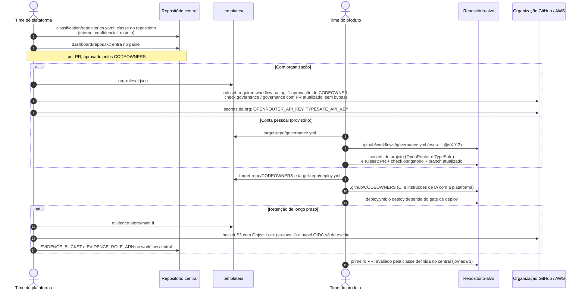
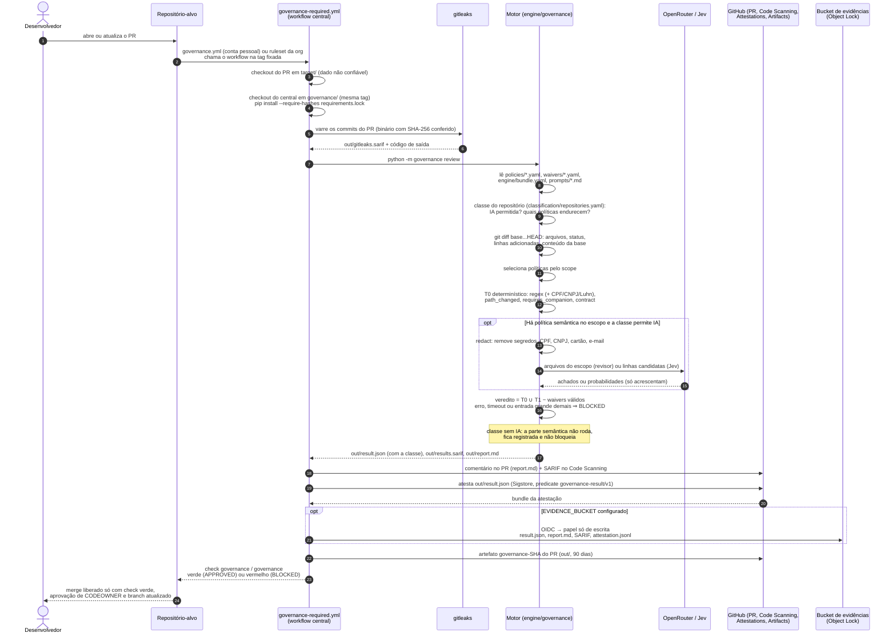
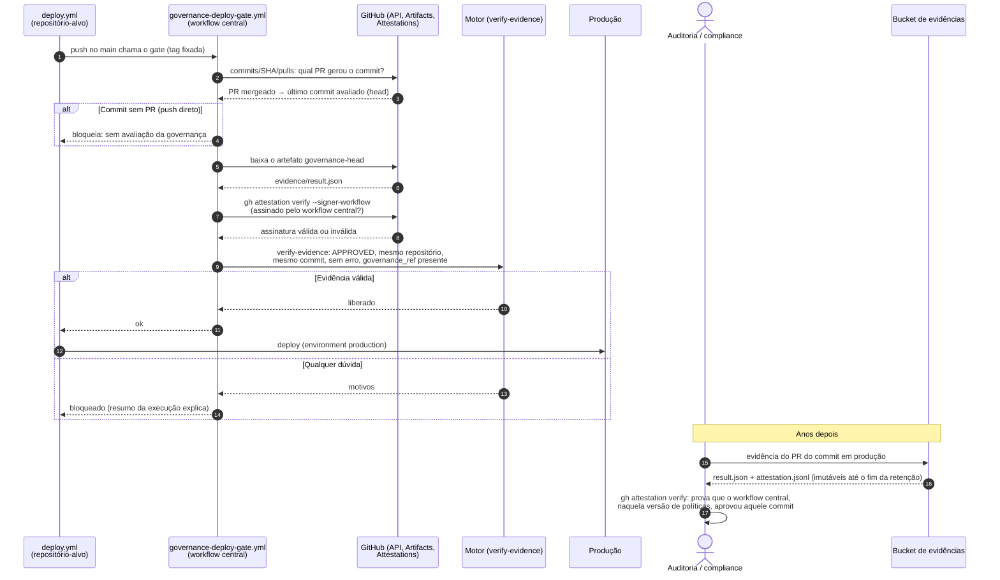

# Fluxo da esteira de governança

Como uma decisão de arquitetura vira regra, como essa regra avalia um Pull Request e
como a evidência chega ao deploy, à auditoria e ao painel de conformidade. São cinco
jornadas, cada uma com os arquivos que lê e os que gera.

- [1. Ciclo de vida de uma regra](#1-ciclo-de-vida-de-uma-regra) (time de plataforma, repositório central)
- [2. Adoção de um repositório-alvo](#2-adoção-de-um-repositório-alvo) (plataforma e time do produto, uma vez)
- [3. Avaliação de um Pull Request](#3-avaliação-de-um-pull-request) (a cada PR)
- [4. Deploy e auditoria](#4-deploy-e-auditoria)
- [5. Painel de conformidade e promoção de regras](#5-painel-de-conformidade-e-promoção-de-regras)
- [Arquivos: quem cria, quando é usado](#arquivos-quem-cria-quando-é-usado)

## 1. Ciclo de vida de uma regra

Passo a passo escrito, com cada campo e cada verificação explicados:
[manual-ciclo-de-vida-de-uma-regra.md](manual-ciclo-de-vida-de-uma-regra.md).

Uma decisão nasce como ADR e vira política, a partir dos templates. Nada chega aos
repositórios-alvo sem testes, validação, exports atualizados, eval sem regressão, tag
de release e smoke test (ADR-GOV-007).

```mermaid
sequenceDiagram
    autonumber
    actor Arq as Arquiteto / time de plataforma
    participant Tpl as templates/
    participant Central as Repositório central<br/>(governance-policies)
    participant CI as ci.yml
    participant LLM as OpenRouter / TypeSafe
    participant PoC as Repositório piloto (PoC)
    participant Dev as Claude Code do desenvolvedor

    Arq->>Tpl: copia adr-template.md
    Arq->>Central: adrs/ADR-AREA-NNN.md (contexto, decisão, alternativas, consequências)
    Arq->>Tpl: copia policy-template.yaml
    Arq->>Central: policies/ID.yaml (escopo, regra, severidade, modo warn,<br/>adr: ADR-AREA-NNN), no formato de policies/schema/policy.schema.json
    Arq->>Central: eval/cases/id-*.yaml (casos positivo e negativo;<br/>base_files quando a regra compara versões)
    opt Regra que depende da classe do repositório
        Arq->>Central: classification/repositories.yaml (raise_mode: a classe só endurece)
    end
    Arq->>Central: python -m governance export
    Central-->>Central: gera exports/aws-security-agent/governance-pack.json<br/>e .claude/rules/governance-policies.md (nunca editados à mão)
    Arq->>Central: sobe a versão do motor (e bundle_version, se mudou o bundle)
    Arq->>Central: abre PR (.github/CODEOWNERS exige o dono da área)
    Central->>CI: PR dispara o ci.yml
    CI->>CI: pytest + validate (schema, ADR citado existe, waivers,<br/>prompts, classificação, cobertura do eval, nenhum submódulo)
    CI->>CI: export --check (gerados em dia) + eval determinístico
    opt Mudança de modelo, prompt, bundle.yaml ou política com LLM
        Arq->>CI: eval --llm --repeat 5
        CI->>LLM: casos com requires_llm (conteúdo sem segredo nem dado pessoal)
        LLM-->>CI: achados / probabilidades
        CI-->>Arq: eval-llm-X.json (números vão na mensagem do commit)
    end
    Arq->>Central: merge + tag vX.Y.Z nova (tag publicada nunca se move)
    Arq->>PoC: smoke test: PR trocando a tag no governance.yml e no deploy.yml
    PoC-->>Arq: PR avaliado na versão nova; merge liberado pelo gate de deploy
    Central-->>Dev: .claude/rules/governance-policies.md orienta o assistente<br/>antes do PR (shift-left)
    Note over Arq,Central: Promoção warn → enforce: novo PR na política,<br/>com os números do painel (jornada 5)
```

## 2. Adoção de um repositório-alvo

O que o time de plataforma e o time do produto fazem, uma vez, para um repositório passar
a ser governado. Os arquivos saem de `templates/`; a classe e o painel ficam no
repositório central, para o repositório-alvo não poder mudá-los.



## 3. Avaliação de um Pull Request

O repositório-alvo não controla nada da avaliação: o workflow, o motor, as políticas, os
prompts e o modelo vêm do repositório central, numa tag fixada. O código do PR é dado,
nunca instrução.



## 4. Deploy e auditoria

O commit que vai para produção é o merge no main, que não é o commit avaliado. O gate de
deploy liga os dois pelo PR e só libera com evidência assinada pelo workflow central.



## 5. Painel de conformidade e promoção de regras

Toda segunda-feira o painel transforma os vereditos em números. É deles que sai a
promoção de uma política de `warn` para `enforce` (ADR-GOV-003 e ADR-GOV-006).

```mermaid
sequenceDiagram
    autonumber
    actor Dev as Desenvolvedor
    participant CS as Code Scanning<br/>(repositório-alvo)
    participant Dash as compliance-dashboard.yml<br/>(repositório central)
    participant GH as GitHub API<br/>(Artifacts, Code Scanning)
    actor Arq as Arquiteto / time de plataforma
    participant Central as Repositório central

    opt Achado errado num PR
        Dev->>CS: dispensa o alerta com o motivo "False positive"<br/>(não desbloqueia; entra na medição)
    end
    Dash->>Dash: segunda-feira 8h (ou Run workflow)<br/>lê dashboard/repos.txt, DASHBOARD_TOKEN
    Dash->>GH: artefatos governance-SHA dos últimos 90 dias
    GH-->>Dash: result.json da última avaliação de cada PR
    Dash->>GH: alertas da ferramenta enterprise-governance em cada PR
    GH-->>Dash: dispensados como "false positive"
    Dash->>Dash: por política: achados, PRs, bloqueios, falso positivo,<br/>dias no modo atual, prontidão para enforce
    Dash->>Dash: geral: aprovados, bloqueados, bloqueados só por erro,<br/>avaliações por classe, waivers vencendo
    Dash-->>Arq: artefato compliance-dashboard<br/>(dashboard.html, .json, .md) + resumo na execução
    alt Política pronta para enforce
        Arq->>Central: PR mudando mode: warn → enforce,<br/>citando os números do painel
    else Falso positivo alto
        Arq->>Central: PR corrigindo a regra (e novos casos de eval)
    end
```

## Arquivos: quem cria, quando é usado

| Arquivo | Quem cria | Quando é usado |
|---|---|---|
| `templates/adr-template.md`, `templates/policy-template.yaml` | Plataforma | Ponto de partida de um ADR e de uma política (jornada 1) |
| `adrs/ADR-*.md` | Arquiteto | Revisão humana; cada política aponta o seu ADR |
| `policies/*.yaml` | Arquiteto (PR com CODEOWNER) | Todo PR avaliado: escopo, regras, severidade, modo |
| `policies/schema/policy.schema.json` | Plataforma | `validate` no CI e na carga do motor |
| `waivers/*.yaml` | Solicitante + aprovador (AppSec) | Todo PR: exceção por repositório, caminho e prazo |
| `classification/repositories.yaml` | Segurança da informação | Todo PR: classe do repositório (IA permitida, políticas endurecidas) |
| `dashboard/repos.txt` | Plataforma | Painel semanal: repositórios medidos |
| `engine/bundle.yaml` | Plataforma (release do bundle) | Todo PR com política semântica: provedor, modelo, orçamento |
| `engine/governance/prompts/*.md` | Plataforma (release do bundle) | Revisor LLM generativo |
| `eval/cases/*.yaml` | Arquiteto | CI do central; `eval --llm` antes de release |
| `eval-llm-*.json` | `eval --llm` | Evidência para promover política ou trocar modelo |
| `exports/aws-security-agent/governance-pack.json` | `export` (gerado) | AWS Security Agent |
| `.claude/rules/governance-policies.md` | `export` (gerado) | Claude Code, antes do PR |
| `.github/CODEOWNERS` (central) | Plataforma | Todo PR no central: quem aprova política, classificação, waiver, motor |
| `templates/target-repo/*`, `templates/org-ruleset.json` | Plataforma | Adoção de um repositório (jornada 2) |
| `templates/evidence-store/main.tf` | Plataforma | Cria o bucket de evidências (jornada 2) |
| `governance.yml` (alvo) / ruleset da org | Plataforma | Dispara a avaliação em todo PR |
| `out/result.json` | Motor, a cada PR | Veredito e classe; atestado; lido pelo gate de deploy, pela auditoria e pelo painel |
| `out/results.sarif`, `out/gitleaks.sarif` | Motor, gitleaks | Anotações na linha (Code Scanning) |
| `out/report.md` | Motor | Comentário no PR e resumo da execução |
| Atestação (Sigstore) | `actions/attest` | Gate de deploy e auditoria: prova de origem |
| Artefato `governance-SHA` | Workflow do PR | Gate de deploy (até 90 dias) |
| Prefixo no bucket de evidências | Workflow do PR (OIDC) | Auditoria (retenção definida por compliance) |
| `deploy.yml` (alvo) | Time do produto | Chama o gate antes do deploy |
| Alerta dispensado como "False positive" | Desenvolvedor, no Code Scanning | Painel: taxa de falso positivo por política |
| Artefato `compliance-dashboard` | Painel semanal | Liderança e promoção `warn` → `enforce` (90 dias) |
