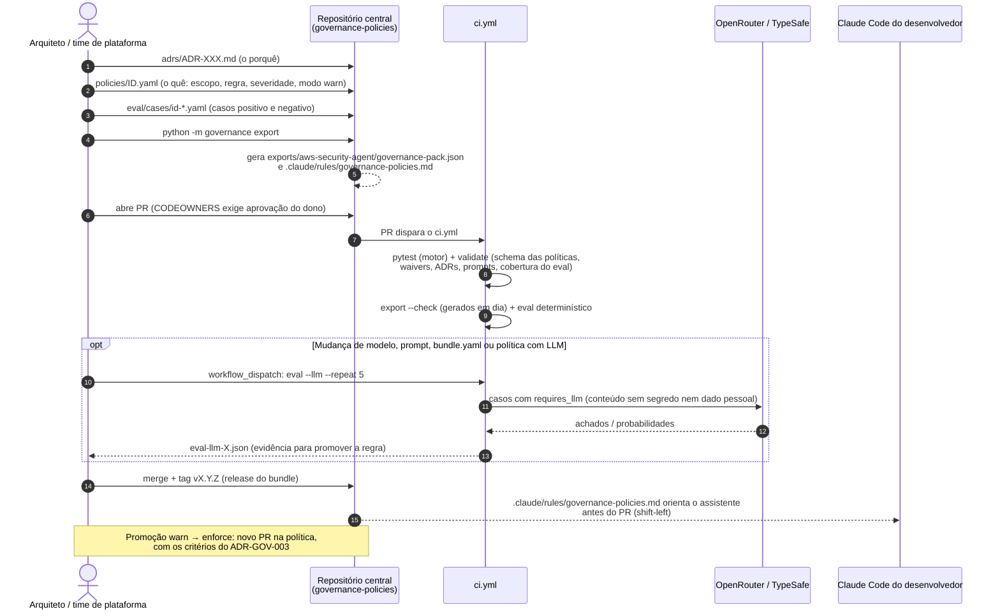
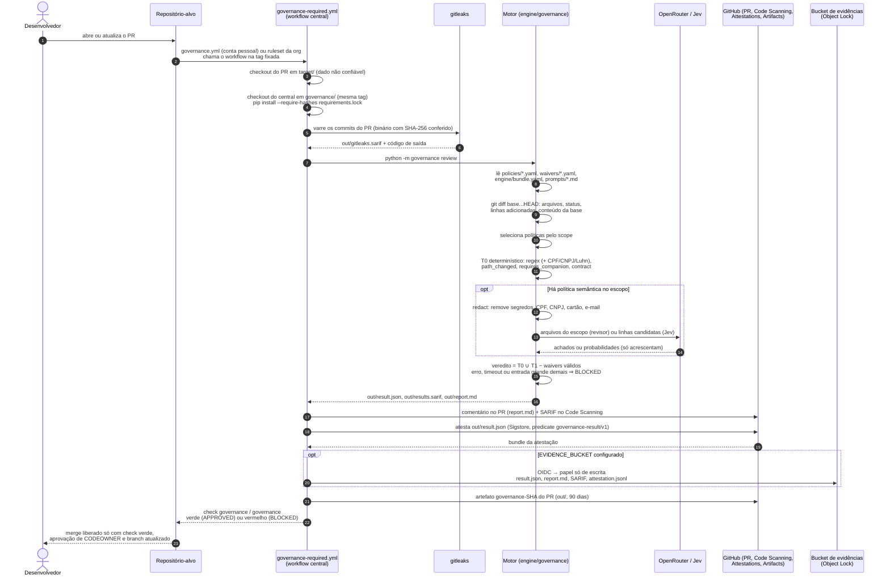
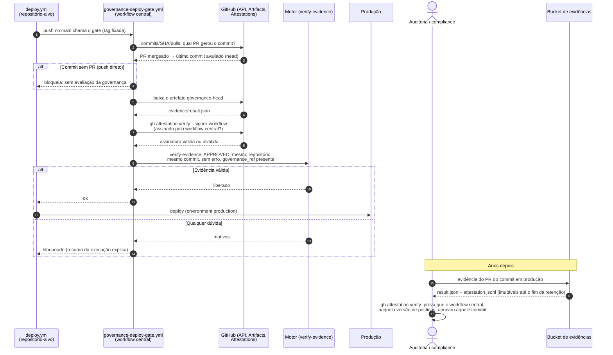

# Fluxo da esteira de governança

Como uma decisão de arquitetura vira regra, como essa regra avalia um Pull Request e
como a evidência chega ao deploy e à auditoria. São três jornadas, cada uma com os
arquivos que lê e os que gera.

- [1. Ciclo de vida de uma regra](#1-ciclo-de-vida-de-uma-regra) (time de plataforma, repositório central)
- [2. Avaliação de um Pull Request](#2-avaliação-de-um-pull-request) (repositório-alvo)
- [3. Deploy e auditoria](#3-deploy-e-auditoria)
- [Arquivos: quem cria, quando é usado](#arquivos-quem-cria-quando-é-usado)

## 1. Ciclo de vida de uma regra

Uma decisão nasce como ADR e vira política. Nada chega aos repositórios-alvo sem
testes, validação, exports atualizados e eval sem regressão; e só depois de uma tag de
release.

## 2. Avaliação de um Pull Request

O repositório-alvo não controla nada da avaliação: o workflow, o motor, as políticas, os
prompts e o modelo vêm do repositório central, numa tag fixada. O código do PR é dado,
nunca instrução.

## 3. Deploy e auditoria

O commit que vai para produção é o merge no main, que não é o commit avaliado. O gate de
deploy liga os dois pelo PR e só libera com evidência assinada pelo workflow central.

## Arquivos: quem cria, quando é usado

| Arquivo | Quem cria | Quando é usado |
|---|---|---|
| `adrs/ADR-*.md` | Arquiteto | Revisão humana; cada política aponta o seu ADR |
| `policies/*.yaml` | Arquiteto (PR com CODEOWNER) | Todo PR avaliado: escopo, regras, severidade, modo |
| `policies/schema/policy.schema.json` | Plataforma | `validate` no CI e na carga do motor |
| `waivers/*.yaml` | Solicitante + aprovador (AppSec) | Todo PR: exceção por repositório, caminho e prazo |
| `engine/bundle.yaml` | Plataforma (release do bundle) | Todo PR com política semântica: provedor, modelo, orçamento |
| `engine/governance/prompts/*.md` | Plataforma (release do bundle) | Revisor LLM generativo |
| `eval/cases/*.yaml` | Arquiteto | CI do central; `eval --llm` antes de release |
| `eval-llm-*.json` | `eval --llm` | Evidência para promover política ou trocar modelo |
| `exports/aws-security-agent/governance-pack.json` | `export` (gerado) | AWS Security Agent |
| `.claude/rules/governance-policies.md` | `export` (gerado) | Claude Code, antes do PR |
| `governance.yml` (alvo) / ruleset da org | Plataforma | Dispara a avaliação em todo PR |
| `out/result.json` | Motor, a cada PR | Veredito; atestado; lido pelo gate de deploy e pela auditoria |
| `out/results.sarif`, `out/gitleaks.sarif` | Motor, gitleaks | Anotações na linha (Code Scanning) |
| `out/report.md` | Motor | Comentário no PR e resumo da execução |
| Atestação (Sigstore) | `actions/attest` | Gate de deploy e auditoria: prova de origem |
| Artefato `governance-SHA` | Workflow do PR | Gate de deploy (até 90 dias) |
| Prefixo no bucket de evidências | Workflow do PR (OIDC) | Auditoria (retenção definida por compliance) |
| `deploy.yml` (alvo) | Time do produto | Chama o gate antes do deploy |
